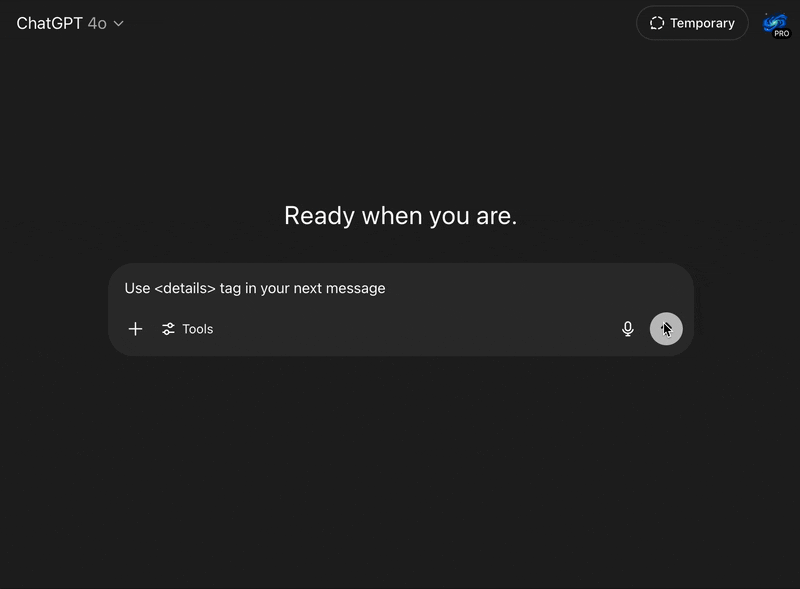

# details-gpt

> **Disclaimer**
> This extension is provided **solely for educational purposes**. It is experimental, may contain bugs, and is *not* recommended for day‑to‑day use. You assume all risk; the author accepts no liability for any consequences arising from its use.



Adds native support for collapsible `<details>` /`<summary>` blocks in ChatGPT, letting you tuck away big tables, long code, or deep-dive notes until the reader extend it.

## TL;DR Install

Make sure you have the latest version of [npm](https://www.npmjs.com/get-npm) installed.

* Clone this repo
* Run `npm i` to install deps, then `npm run watch` to start the watcher
* Open `chrome://extensions`
* Enable developer mode and load the root folder of this repo as an unpacked extension.
* Ask ChatGPT to use the `<details>` tag in the next message (or add [custom instruction](https://openai.com/index/custom-instructions-for-chatgpt/) to always use it)

## Custom instruction examples

```markdown
Please include expandable sections for any optional notes, advanced tips, or deeper explanations by using `<details>` and `<summary>` tags in your responses.
```

## Features

* [x] `<details>` and `<summary>` tags rendering
* [ ] add `data-start` and `data-end` attributes elements created by extension

## License

This project is distributed under the terms of both the MIT license and the Apache License (Version 2.0).

See [LICENSE-APACHE](./licenses/LICENSE-APACHE) and [LICENSE-MIT](./licenses/LICENSE-MIT).
